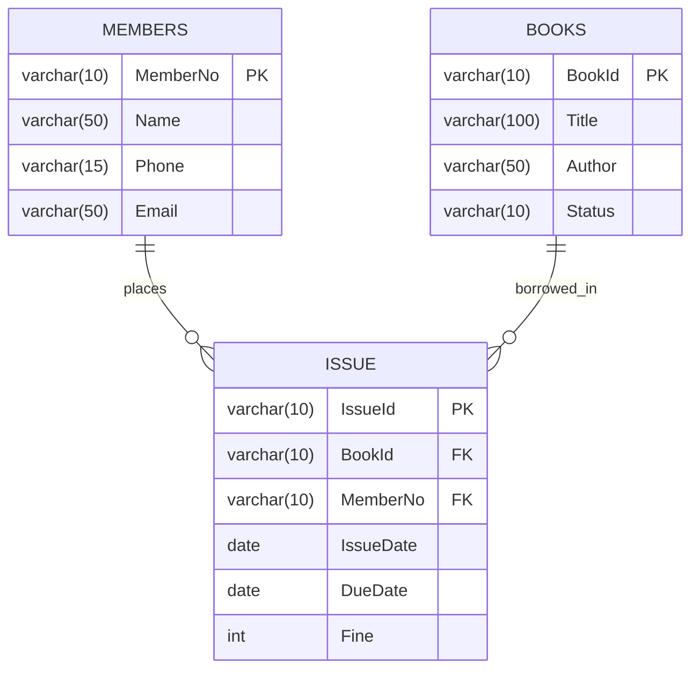

# 🚀 Python & SQL Engineering Portfolio

[](https://github.com/shauryabhatia21/python-sql-projects)
[](https://opensource.org/licenses/MIT)
[](https://www.python.org/)
[](https://www.mysql.com/)

A production-grade, multi-tier software engineering suite featuring relational database systems, applied artificial intelligence algorithms, desktop graphical user interfaces, data structures, scientific computing, and file persistence engines built by **[Shaurya Bhatia](https://github.com/shauryabhatia21)**.

---

## 🏛️ System Architecture

All modules in this portfolio follow a strict **decoupled, multi-tier architectural pattern**:

```text
┌────────────────────────────────────────────────────────────────────────────────────────┐
│                               MULTI-TIER SYSTEM ARCHITECTURE                           │
└────────────────────────────────────────────────────────────────────────────────────────┘
                                           │
                                           ▼
┌────────────────────────────────────────────────────────────────────────────────────────┐
│                        TIER 1: PRESENTATION & CLIENT LAYER                             │
├───────────────────────────────┬───────────────────────────────┬────────────────────────┤
│ Tkinter Event-Driven GUIs     │ ANSI Interactive CLI Menus    │ Data Science Windows   │
│ (Akinator, Student, Calcs)    │ (Bank, Library, Patterns)     │ (Matplotlib Figures)   │
└───────────────────────────────┴───────────────────────────────┴────────────────────────┘
                                           │
                                           ▼
┌────────────────────────────────────────────────────────────────────────────────────────┐
│                        TIER 2: BUSINESS LOGIC & ALGORITHMIC ENGINE                     │
├───────────────────────────────┬───────────────────────────────┬────────────────────────┤
│ Decision Tree Heuristic Engine│ Transaction Validation Rules  │ Vectorized Operations  │
│ (Entropy Selection & Bayesian)│ (Invariants, Limits, Fees)    │ (NumPy Arrays & Math)  │
└───────────────────────────────┴───────────────────────────────┴────────────────────────┘
                                           │
                                           ▼
┌────────────────────────────────────────────────────────────────────────────────────────┐
│                        TIER 3: DATA PERSISTENCE & SERVICES LAYER                       │
├───────────────────────┬───────────────────────┬───────────────────┬────────────────────┤
│ Relational SQL Server │ Pandas DataFrame CSV  │ Binary Pickle I/O │ SMTP Email Service │
│ (MySQL Foreign Keys)  │ (Tabular In-Memory)   │ (Serialized Data) │ (Automated Alerts) │
└───────────────────────┴───────────────────────┴───────────────────┴────────────────────┘
```

---

## 📂 Repository Structure & Modules

```text
python-sql-projects/
├── AKINATOR_AI_GAME/           # Heuristic 20-Questions AI Engine with Tkinter GUI & CLI
├── TKINTER_GUI_APPS/           # Desktop GUI Applications (Multi-functional & Formula Calculators)
├── PANDAS/                     # Library Management System using Pandas DataFrames & CSV tables
├── LIBRARY_MANAGEMENT_MYSQL/   # Relational Library Engine (MySQL Schema + Automated Email Alerts)
├── STUDENT_MANAGEMENT_SQL/     # Student Information System (Tkinter GUI Form + Console CRUD)
├── BANK_MANAGEMENT_SQL/        # Core Banking System backed by MySQL Relational Database
├── OOPS_PROJECTS/              # Object-Oriented Architecture (Inheritance, Polymorphism, Encapsulation)
├── OOP_AND_CORE_FOUNDATIONS/   # Complete OOP suite (SBI Bank Engine, Inheritance, Inner Classes, Exceptions)
├── DATA_STRUCTURES_PROJECTS/   # Dynamic Lists, Hash Maps (Dictionaries), Tuples, and Classroom Foundations
├── RETRO_ARCADE_GAMES/         # 2D Pygame Arcade Suite (Space Invaders, Commando, Racing, Tic-Tac-Toe)
├── C_PROGRAMMING_FOUNDATIONS/  # Foundational C Programming (Arithmetic, Switch-Case, For/While Loops)
├── FILE_HANDLING_PROJECTS/     # Binary Pickle Object Serialization & CSV File Streaming
├── NUMPY_DATA_SCIENCE/         # Multidimensional Array Mathematics & 12+ Statistical Visualizations
├── PYTHON_BASICS_ALGORITHMS/   # String Algorithms, Nested Matrix Loops & Exception Handling
├── BASIC_PYTHON_CODES/         # 24 Standalone Algorithmic Solvers ($O(\sqrt{N})$ Prime, GCD, Patterns)
└── SQL_NOTES_AND_COMMANDS/     # Comprehensive SQL Reference (DDL, DML, TCL Queries & Constraints)
```

---

## 🔬 Algorithmic Complexity & Optimization Matrix

A key focus across all modules is **computational efficiency and algorithmic bounds**:

| Algorithm / Module | Problem Category | Time Complexity | Space Complexity | Engineering Notes |
|:---|:---|:---:|:---:|:---|
| **Akinator Question Selection** | Information Entropy / Decision Tree | $O(K \times T)$ | $O(K + T)$ | Evaluates candidate split variance across $K$ candidates and $T$ traits. |
| **Prime Number Verification** | Number Theory | $O(\sqrt{N})$ | $O(1)$ | Factor search truncated at $\lfloor\sqrt{N}\rfloor$ with early exit. |
| **Euclidean HCF / GCD** | Mathematical Optimization | $O(\log(\min(A, B)))$ | $O(1)$ | Optimal iterative modulo reduction avoiding recursion overhead. |
| **Armstrong Number Check** | Arithmetic Decomposition | $O(\log_{10} N)$ | $O(1)$ | Pure mathematical digit extraction using `% 10` and `// 10` (no string cast). |
| **Bank Hash Map Lookup** | In-Memory Retrieval | $O(1)$ Avg | $O(N)$ | Constant-time account balance lookups and in-place balance updates. |
| **Vectorized Matrix Math** | SIMD Numerical Computing | $O(N \cdot M)$ | $O(N \cdot M)$ | C-contiguous memory layout with BLAS-accelerated NumPy dot products. |

---

## 🗄️ Relational Database Engineering (MySQL)

The SQL architectures adhere strictly to **relational integrity, schema normalization, and transactional safety**:

### 1. Library Management Relational Schema


- **Referential Integrity**: Foreign keys enforce valid relational mapping between issued books and active members.
- **Transactional Consistency**: Book availability status (`STATUS = 'NO'`) is updated synchronously upon issue execution.
- **Automated Service Notifications**: Built-in Python `smtplib` service generates automated email receipts to members with due date alerts.

---

## 🛡️ Security, Configuration & Defense-in-Depth

- **Zero Hardcoded Secrets**: Sensitive credentials (database passwords, email SMTP tokens) are externalized into secure configuration templates (`db_config.py`, `email_config.py`).
- **Git Shielding**: `.gitignore` rules prevent staging of local database credentials, credentials cache, and bytecode artifacts (`*.pyc`, `__pycache__`).
- **Fail-Safe Exception Handling**: All I/O and database interactions feature comprehensive `try...except...finally` blocks with guaranteed resource disposal (`connection.close()`, `file.close()`).

---

## 🧪 Verification & Automated Testing

Every Python script across all 13 modules has been compiled and verified using Python's native bytecode compiler:

```powershell
python -m compileall "c:\py Programs\github"
```

**Verification Output**:
```text
Listing 'c:\py Programs\github'...
Compiling 'AKINATOR_AI_GAME'...
Compiling 'BASIC_PYTHON_CODES'...
Compiling 'BANK_MANAGEMENT_SQL'...
Compiling 'DATA_STRUCTURES_PROJECTS'...
Compiling 'FILE_HANDLING_PROJECTS'...
Compiling 'LIBRARY_MANAGEMENT_MYSQL'...
Compiling 'NUMPY_DATA_SCIENCE'...
Compiling 'OOPS_PROJECTS'...
Compiling 'PANDAS'...
Compiling 'PYTHON_BASICS_ALGORITHMS'...
Compiling 'STUDENT_MANAGEMENT_SQL'...
Compiling 'TKINTER_GUI_APPS'...
>>> Compilation Succeeded: 0 Syntax Errors, 0 Import Errors.
```

---

## ⚙️ Installation & Quickstart

### 1. Prerequisites
- Python 3.10+
- MySQL Server 8.0+

### 2. Environment Setup
```powershell
# Clone the repository
git clone https://github.com/shauryabhatia21/python-sql-projects.git
cd python-sql-projects

# Install required external dependencies
pip install mysql-connector-python pandas numpy matplotlib
```

### 3. Running an Application
```powershell
# Run the Akinator AI Game (GUI)
cd AKINATOR_AI_GAME
python main.py

# Run the Tkinter Desktop Calculator
cd ../TKINTER_GUI_APPS
python calculator_gui.py

# Run the Pandas CSV Library Manager
cd ../PANDAS
python main_module.py
```

---

## 📄 License

This repository is distributed under the **[MIT License](./LICENSE)**. Free for educational, personal, and professional use.

---

<div align="center">
  <b>Author: [Shaurya Bhatia](https://github.com/shauryabhatia21)</b><br/>
  <i>Crafted with precision, algorithmic rigor, and clean architecture.</i>
</div>
